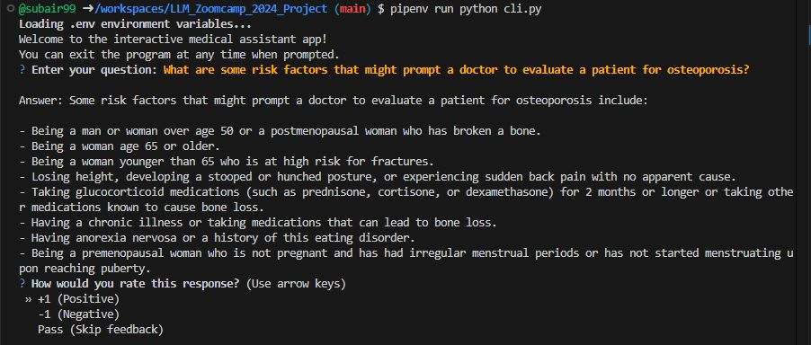

# Medical Assistant

<p align="center">
  
</p>


Staying organized and efficient in a medical office can be 
challenging, especially for those new to the field. Managing 
patient records, appointments, and medical supplies can be 
overwhelming.

The Medical Assistant AI provides a conversational tool that 
assists users in streamlining administrative tasks, managing 
patient schedules, and offering guidance on best practices, 
making the role of a medical assistant more manageable.


This project was implemented as a requirement for the completion of 
[LLM Zoomcamp](https://github.com/DataTalksClub/llm-zoomcamp) -
a free course about LLMs and RAG.

<p align="center">
  
</p>


## Project overview

The Medical Assistant is a RAG application designed to assist users with their medical conditions. It enables practitioners to quickly diagnose problems thereby saving time and cost.


## Dataset

The dataset used in this project was obtained from [kaggle](https://www.kaggle.com/datasets/pythonafroz/medquad-medical-question-answer-for-ai-research) and known as MedQuAD, short for Medical Question Answering Datase.

It contains information about various medical conditions, answers, source and focus area with 16393 rows after cleaning. 

Due to cost, only 198 rows were chosen but they were spread evenly across the 19 sources, and ChatGPT was used to generate additional 4 questions each. The link to the data is [`data.csv`](data/data.csv),
while the link to the questions is [`ground-truth-retrieval.csv`](data/ground-truth-retrieval.csv).


## Technologies

- Python 3.12
- Docker and Docker Compose for containerization
- [Minsearch](https://github.com/alexeygrigorev/minsearch) for full-text search
- Flask as the API interface (see [Flask](https://flask.palletsprojects.com/en/stable/) for more information on Flask)
- Grafana for monitoring (see [Grafana](https://grafana.com/) for more information on Grafana)
- PostgreSQL as the backend (see [PostgreSQL](https://www.postgresql.org/) for more information on PostgreSQL)
- OpenAI as the LLM (see [OpenAI](https://openai.com/) for more information on OpenAI)


## Preparation

Since OpenAI was used, there is need to provide an API key for it:

1. Install `direnv`. If you use Ubuntu, run `sudo apt install direnv` and then `direnv hook bash >> ~/.bashrc`.
2. Copy `.envrc_template` into `.envrc` and insert your key there.
3. For OpenAI, it's recommended to create a new project and use a separate key.
4. Run `direnv allow` to load the key into your environment.

For dependency management, pipenv was used, so its installation is required:

```bash
pip install pipenv
```

Then the required programs:

```bash
pipenv install openai scikit-learn pandas flask psycopg2-binary python-dotenv gunicorn tzdata requests pgcli questionary
```

And the programs used for development:

```bash
pipenv install --dev tqdm notebook==7.1.2 ipywidgets export requests pgcli python-version 
```


## Running the application

### Database configuration

Before the application starts for the first time, the database needs to be initialized.

First, run `postgres`:

```bash
docker-compose up postgres
```

Then run the [`db_prep.py`](medical_assistant/db_prep.py) script:

```bash
pipenv shell

cd medical_assistant

export POSTGRES_HOST=localhost
python db_prep.py
```

To check the content of the database, use `pgcli` (already installed with pipenv):

```bash
pipenv run pgcli -h localhost -U your_username -d course_assistant -W
```

You can view the schema using the `\d` command:

```sql
\d conversations;
```

And select from this table:

```sql
select * from conversations;
```


### Running with Docker-Compose

The easiest way to run the application is with `docker-compose`:

```bash
docker-compose up
```

### Running locally

If the application is to be run locally, start only postres and grafana:

```bash
docker-compose up postgres grafana
```

If all the applications were previously started with
`docker-compose up`, you need to stop the `app`:

```bash
docker-compose stop app
```

Now run the app on the host machine:

```bash
pipenv shell

cd medical_assistant

export POSTGRES_HOST=localhost
python app.py
```

### Running with Docker (without compose)

To run the application in Docker without Docker Compose, e.g., for debugging purposes.

First, prepare the environment by running Docker Compose as in the previous section.

Next, build the image:

```bash
docker build -t medical-assistant .
```

And run it:

```bash
docker run -it --rm \
    --network="medical-assistant_default" \
    --env-file=".env" \
    -e OPENAI_API_KEY=${OPENAI_API_KEY} \
    -e DATA_PATH="data/data.csv" \
    -p 5000:5000 \
    medical-assistant
```

### Time configuration

When inserting logs into the database, ensure the timestamps are correct. Otherwise, they won't be displayed accurately in Grafana.

The following logs will be seen when tha application is atarted:

```
Database timezone: Etc/UTC
Database current time (UTC): 2024-08-24 06:43:12.169624+00:00
Database current time (Africa/Lagos): 2024-08-24 08:43:12.169624+02:00
Python current time: 2024-08-24 08:43:12.170246+02:00
Inserted time (UTC): 2024-08-24 06:43:12.170246+00:00
Inserted time (Africa/Lagos): 2024-08-24 08:43:12.170246+02:00
Selected time (UTC): 2024-08-24 06:43:12.170246+00:00
Selected time (Africa/Lagos): 2024-08-24 08:43:12.170246+02:00
```

Ensure the time is correct.

The timezone can be changed by replacing `TZ` in `.env`.

On some systems, specifically WSL, the clock in Docker may get out of sync with the host system. This can checked that by running:

```bash
docker run ubuntu date
```

There is need to sync the clock if the time doesn't match:

```bash
wsl

sudo apt install ntpdate
sudo ntpdate time.windows.com
```

Note that the time is in UTC.

After that, start the application (and the database) again.


## Using the application

When the application is running, it can be used.

### CLI

An interactive CLI application was built using
[questionary](https://questionary.readthedocs.io/en/stable/).

To start it, run:

```bash
pipenv run python cli.py
```

It can also be made to randomly select a question from
[the ground truth dataset](data/ground-truth-retrieval.csv):

```bash
pipenv run python cli.py --random
```

### Using `requests`

When the application is running [requests](https://requests.readthedocs.io/en/latest/) can be used to send questions—use [test.py](test.py) for testing:

```bash
pipenv run python test.py
```

It will pick a random question from the ground truth dataset and send it to the app.


### CURL

To interact with the API `curl` can also be used:

```bash
URL=http://localhost:5000
QUESTION="What are the main components of an artificial knee?"
DATA='{
    "question": "'${QUESTION}'"
}'

curl -X POST \
    -H "Content-Type: application/json" \
    -d "${DATA}" \
    ${URL}/question
```

The response will be similar to the massage below:

```json
{
    "answer": "Yes, the Lat Pulldown is considered a strength training activity. This classification is due to it targeting specific muscle groups, specifically the Latissimus Dorsi and Biceps, which are essential for building upper body strength. The exercise utilizes a machine, allowing for controlled resistance during the pulling action, which is a hallmark of strength training.",
    "conversation_id": "4e1cef04-bfd9-4a2c-9cdd-2771d8f70e4d",
    "question": "Is the Lat Pulldown considered a strength training activity, and if so, why?"
}
```

Sending feedback:

```bash
ID="4e1cef04-bfd9-4a2c-9cdd-2771d8f70e4d"
URL=http://localhost:5000
FEEDBACK_DATA='{
    "conversation_id": "'${ID}'",
    "feedback": 1
}'

curl -X POST \
    -H "Content-Type: application/json" \
    -d "${FEEDBACK_DATA}" \
    ${URL}/feedback
```

After sending, it will be acknowledgement as below:

```json
{
    "message": "Feedback received for conversation 4e1cef04-bfd9-4a2c-9cdd-2771d8f70e4d: 1"
}
```


## Code

The code for the application is in the [`medical_assistant`](medical_assistant/) folder:

- [`app.py`](medical_assistant/app.py) - the Flask API, the main entrypoint to the application
- [`rag.py`](medical_assistant/rag.py) - the main RAG logic for building the retrieving the data and building the prompt
- [`ingest.py`](medical_assistant/ingest.py) - loading the data into the knowledge base
- [`minsearch.py`](medical_assistant/minsearch.py) - an in-memory search engine
- [`db.py`](medical_assistant/db.py) - the logic for logging the requests and responses to postgres
- [`db_prep.py`](medical_assistant/db_prep.py) - the script for initializing the database

there are also some codes in the project root directory:

- [`test.py`](test.py) - select a random question for testing
- [`cli.py`](cli.py) - interactive CLI for the APP


### Interface

Flask was used for serving the application as an API.

Refer to the ["Using the Application" section](#using-the-application) for examples on how to interact with the application.


### Ingestion

The ingestion script is in [`ingest.py`](medical_assistant/ingest.py).

Since an in-memory database, `minsearch`, was used as the knowledge base, the ingestion script was ran at the startup of the application.

It will be executed inside [`rag.py`](medical_assistant/rag.py) when imported.


## Experiments

For experiments, Jupyter notebooks was used. They are in the [`notebooks`](notebooks/) folder.

To start Jupyter, run:

```bash
cd notebooks
pipenv run jupyter notebook
```

We have the following notebooks:

- [`prepare_data.ipynb`](prepare_data.ipynb): The data preparation for the project.
- [`rag-test.ipynb`](notebooks/rag-test.ipynb): The RAG flow and evaluating the system.
- [`evaluation-data-generation.ipynb`](notebooks/evaluation-data-generation.ipynb): Generating the ground truth dataset for retrieval evaluation.
- 


### Retrieval evaluation

The basic approach - using `minsearch` without any boosting - gave the following metrics:

- Hit rate: 98.8%
- MRR:      88.5%

The improved version (with tuned boosting):

- Hit rate: 99.2%
- MRR:      93.4%

The best boosting parameters were:

```python
boost = {
    'answer':  1.499870942849007,
    'source': 2.6492671100128127,
    'focus_area': 0.7714670319653344
}
```


### RAG flow evaluation

LLM-as-a-Judge metric was used to evaluate the quality of the RAG flow for a sample with 198 records.


For `gpt-4o-mini`, the result was:

- 186 (93.0%) `RELEVANT`
- 9 (0.45%) `PARTLY_RELEVANT`
- 5 (0.25%) `NON_RELEVANT`


For `gpt-4o`, the result was:

- 181 (90.0%) `RELEVANT`
- 12 (6.0%) `PARTLY_RELEVANT`
- 7 (3.5%) `NON_RELEVANT`

The `gpt-4o-mini` was choosen because it performed better.


## Monitoring

Grafana was used for monitoring the application. 

It's accessible at [localhost:3000](http://localhost:3000):

- Login: "admin"
- Password: "admin"

### Dashboards

<p align="center">
  
</p>

<p align="center">
  
</p>

<p align="center">
  
</p>

<p align="center">
  
</p>

<p align="center">
  
</p>

The monitoring dashboard contains several panels:

1. **Last 5 Conversations (Table):** Displays a table showing the five most recent conversations, including details such as the question, answer, relevance, and timestamp. This panel helps monitor recent interactions with users.
2. **+1/-1 (Pie Chart):** A pie chart that visualizes the feedback from users, showing the count of positive (thumbs up) and negative (thumbs down) feedback received. This panel helps track user satisfaction.
3. **Relevancy (Gauge):** A gauge chart representing the relevance of the responses provided during conversations. The chart categorizes relevance and indicates thresholds using different colors to highlight varying levels of response quality.
4. **OpenAI Cost (Time Series):** A time series line chart depicting the cost associated with OpenAI usage over time. This panel helps monitor and analyze the expenditure linked to the AI model's usage.
5. **Tokens (Time Series):** Another time series chart that tracks the number of tokens used in conversations over time. This helps to understand the usage patterns and the volume of data processed.
6. **Model Used (Bar Chart):** A bar chart displaying the count of conversations based on the different models used. This panel provides insights into which AI models are most frequently used.
7. **Response Time (Time Series):** A time series chart showing the response time of conversations over time. This panel is useful for identifying performance issues and ensuring the system's responsiveness.


### Setting up Grafana

All Grafana configurations are in the [`grafana`](grafana/) folder:

- [`init.py`](grafana/init.py) - for initializing the datasource and the dashboard.
- [`dashboard.json`](grafana/dashboard.json) - the actual dashboard (taken from LLM Zoomcamp without changes).

To initialize the dashboard, first ensure Grafana is running (it starts automatically when `docker-compose up` is run).

Then run:

```bash
pipenv shell

cd grafana

# esure the POSTGRES_HOST variable is not overwritten 
env | grep POSTGRES_HOST

python init.py
```

Then go to [localhost:3000](http://localhost:3000):

- Login: "admin"
- Password: "admin"

When prompted, keep "admin" as the new password.


## Acknowledgements

My greatest appreciation goes to [Alexey Grigorev](https://www.linkedin.com/feed/?highlightedUpdateType=SHARED_BY_YOUR_NETWORK&highlightedUpdateUrn=urn%3Ali%3Aactivity%3A7254859071965548545#:~:text=post%20number%201-,Alexey%20Grigorev,-Alexey%20Grigorev) for his generosity, guidance and selfless dedication in providing these courses. Your willingness to share your expertise has transformed my learning journey. Your guidance, support, and passion for teaching inspire me. Thank you for making a difference in my life!
